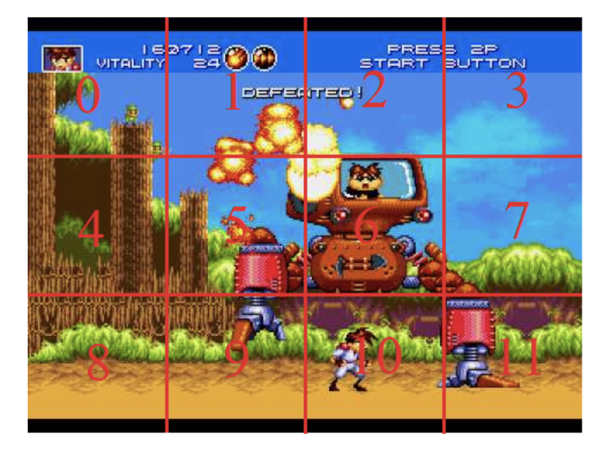
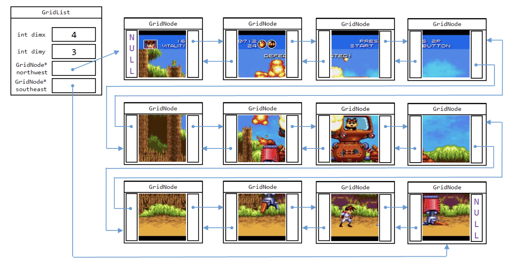

# graph-process-C++

## Parsed Image into Blocks

- A Linked List is a dynamic linear structure designed to hold any type of data. In this exercise, we develop and use a doubly-linked list to manipulate blocks of pixels from an image.
  

- Each Block is placed into a GridNode of a GridList, as shown here:
  

---

## Automated Imae with Flood Fill

1.  With Border Color Picker

- Using BFS Algorithm

  

- Using DFS Algorithm

  

2.  With Solid Color Picker

- Using BFS Algorithm

  

- Using DFS Algorithm

  

3.  With Fade Color Picker

- Using BFS Algorithm

  

- Using DFS Algorithm

  

---

## Graph Compression

- The inspiration for this assignment came from an article about an artist whose work recreates classic portraits with a blocky effect. The exact algorithm he used is not given in the article, but we will create similar images using a strategy for image representation that underlies common lossy image compression algorithms.

- The two images below illustrate the result of this assignment. Note that the second image sacrifices color detail in rectangles that do not contain much color variability in the original image, but maintains detail by using smaller rectangles in areas of the original image containing lots of variability.

- Before

  
- After

  
